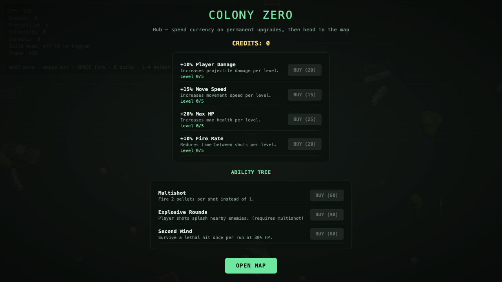
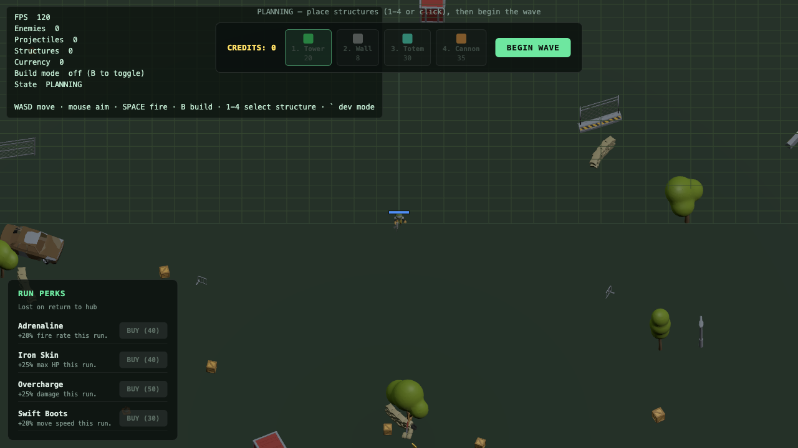
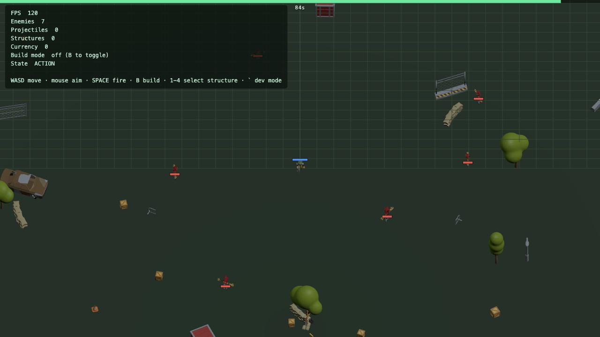
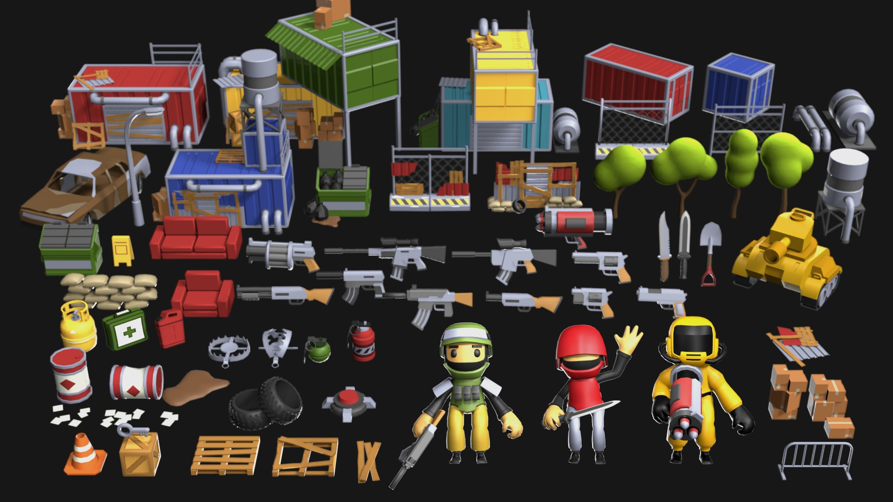

# Colony Zero

A browser-based **survivors-like / tower defense hybrid** built with TypeScript, Vite, and Three.js (WebGPU). Fight escalating waves on a 2.5D isometric map, place towers and defenses between waves, and spend currency on permanent upgrades in the hub.

## Screenshots

| Hub — permanent upgrades & ability tree | Planning — build before the wave |
| --- | --- |
|  |  |

| Combat — survival action phase | glTF characters & environment (preview) |
| --- | --- |
|  |  |

## Gameplay loop

1. **Hub** — Buy permanent stat upgrades and unlock abilities with credits earned from runs.
2. **Planning** — Open the map, spend credits on towers, walls, healing totems, and cannons (keys `1`–`4` or click the palette). Optional **run perks** apply for the current wave only.
3. **Action** — Survive a timed wave: move, aim with the mouse, auto-fire with **Space**, and let structures fight alongside you.
4. **Resolution** — Clear the timer to win (bonus credits) or die and return to the hub with partial earnings.

## Controls

| Input | Action |
| --- | --- |
| **WASD** / arrow keys | Move |
| **Mouse** | Aim |
| **Space** | Fire |
| **B** | Toggle build mode (planning phase) |
| **1–4** | Select structure type |
| **`** (backtick) | Toggle dev panel |

## Tech stack

- **Runtime:** TypeScript, Vite 6
- **Rendering:** Three.js `WebGPURenderer`, orthographic isometric camera
- **Performance:** Object pooling, instanced meshes, spatial hashing for collisions (designed for thousands of entities)

## Getting started

**Requirements:** Node.js 20+ and a browser with WebGPU (recent Chrome, Edge, or Safari).

```bash
npm install
npm run dev
```

Open the URL Vite prints (default [http://localhost:5173](http://localhost:5173)).

```bash
npm run build    # production bundle → dist/
npm run preview  # serve dist/
npm run typecheck
```

### Performance smoke test

Append a query string to jump straight into a burst spawn (dev harness from `Plan.md`):

```text
http://localhost:5173/?perftest=1000
```

### Refresh README screenshots

With the dev server running:

```bash
PLAYWRIGHT_HEADED=1 node scripts/capture-readme-screenshots.mjs
```

## Project layout

```text
src/
  core/       Scene rig, pooling, assets, gauntlet state machine
  entities/   Player, enemies, projectiles, structures, environment
  systems/    Combat, spawning, placement, upgrades, perks
  ui/         Hub, planning, HUD, dev panel
public/models/  glTF characters and environment props
```

## Status

Early MVP: core gauntlet loop, structure placement, upgrades, abilities, and run perks are in place. See [`Plan.md`](Plan.md) for the original architecture goals and performance constraints.
